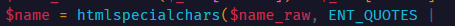
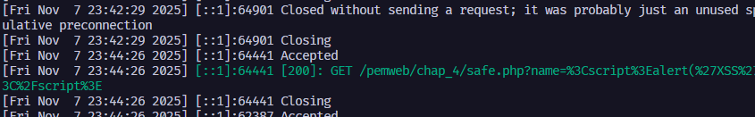
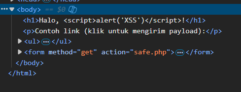
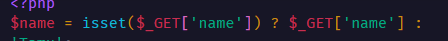
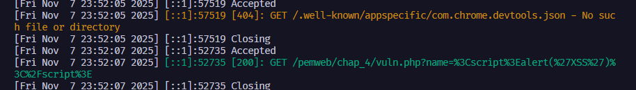
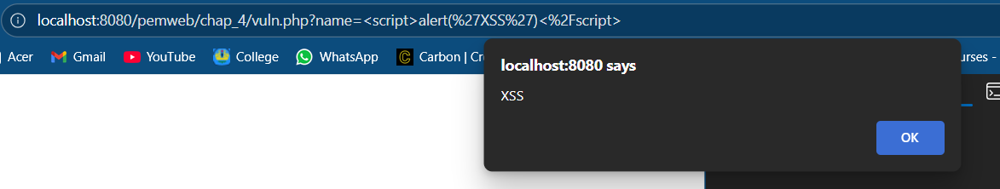
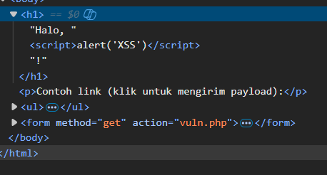

ini buat test html sanitazion

di modul itu ada _htmlspecialchars()_, nah pakai ini buat demo bagaimana pentingnya html sanitazion buat mencegah XSS
BUAT RUN KODE INI, CUKUP jalanin perintah

```php
cd pemweb/chap_4
php -S localhost:<port>
```

pake port yang ga dipake ex: 8080, 1234

test inject alert js di payload url

DEMO :
_safe.php_



#### Payload ketika kirim alert('XSS')



#### Hasil di DOM



Muncul script dianggap sebagai text plain, ini berkat _htmlspecialchars_ sehingga dapat mengatasi XSS (Cross-site scripting)

_vuln.php_



#### Payload ketika kirim alert('XSS')



Hasil nya bisa dilihat di web



#### Hasil di DOM



Muncul isi tag "h1" ada tag "script" yang dimana ini indikasi dari XSS (Cross-site Scripting). Hal ini disebabkan oleh tanpa ada nya html sanitazion atau tidak di handle menggunakan _htmlspecialchars()_
